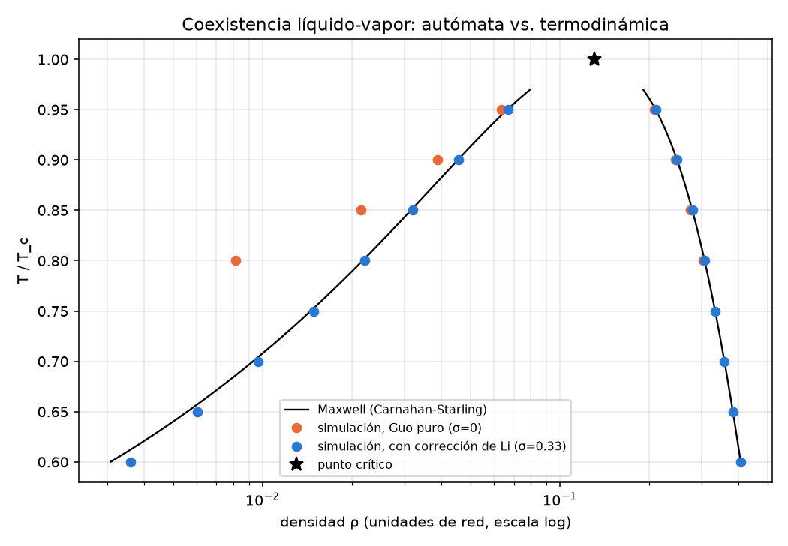
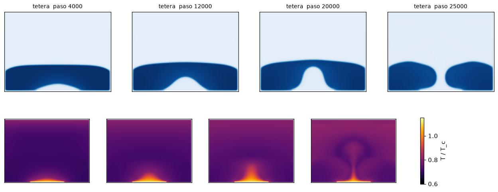
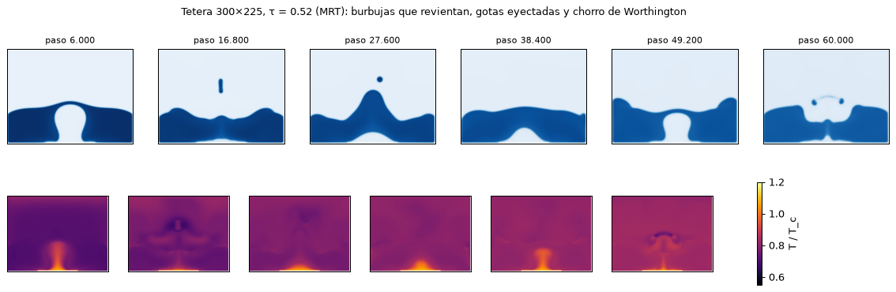

# Aguacero

Un autómata celular de fluido donde **cada pixel es un punto con estado
termodinámico propio**: densidad, velocidad, temperatura, presión y
energía. El agua cae, salpica, escurre por repisas, se evapora y hierve
sobre una placa caliente, y puedes pintar agua, paredes, calor o frío con
el mouse mientras corre (pygame).

Hermano de [`Colapsoscopio`](../Colapsoscopio) y
[`Caoscopio`](../Caoscopio): mismo repo, otro rincón de la física.

```bash
cd Aguacero
pip install -e .          # numpy, scipy, matplotlib, pygame (+ numba recomendado)
pip install numba         # opcional: ~5× más rápido, necesario para tiempo real cómodo
python -m aguacero        # escena "grifo"
python -m aguacero tetera # placa caliente: ebullición
python -m aguacero gota --escala 5
```

| tecla | acción |
|---|---|
| `1`–`5` | vista: agua · temperatura · presión · rapidez · vorticidad |
| `A P B C F` | pincel: agua · pared · borrar · calentar · enfriar |
| clic izq. / der. | pintar / borrar · rueda o `[` `]`: radio |
| `ESPACIO` `N` | pausa · un paso |
| `+` `−` | pasos de simulación por cuadro |
| `G` `R` `S` `H` | gravedad on/off · reiniciar · captura PNG · ayuda |

Versión de navegador (sin instalar nada, también en el celular):
`python web/construir.py salidas/aguacero.html` arma una página
autocontenida con el mismo paso traducido a JavaScript (~120 pasos/s en
un escritorio, ~3× más lento que numba).

El panel lateral muestra masa total (y cuánta agregaron las
herramientas), energías cinética/potencial/interna, T media del líquido,
y una **sonda del pixel bajo el cursor**: ρ, T/T_c, p/p_c, |u| y fase.

## La contrapropuesta: por qué no un "falling sand"

Lo habitual para "agua pixel a pixel" es un *falling-sand game* (Noita,
Powder Toy): cada pixel es una partícula de un material y una regla ad
hoc dice "si abajo está vacío, baja; si no, prueba en diagonal; si no, a
los lados". Es rapidísimo y se ve bien, pero **no tiene termodinámica**:
no hay presión que obedezca una ecuación de estado, la "temperatura" es
una etiqueta que se difunde, y no existe nada que conservar salvo el
número de partículas. Pegarle T, p y E a eso es decorado.

El camino riguroso *también* es un autómata celular — el que llevó de
los gases de red de Hardy-Pomeau-de Pazzis (1973) y Frisch-Hasslacher-
Pomeau (1986) a **lattice Boltzmann**: en cada pixel viven 9 poblaciones
de partículas f_i con velocidades discretas e_i (red D2Q9), y cada paso
es colisión local + propagación a los vecinos. En el límite hidrodinámico
(Chapman-Enskog) eso *es* Navier-Stokes compresible. Sobre esa base:

- **Líquido y vapor emergen de una ecuación de estado real.** Modelo de
  pseudopotencial (Shan-Chen): una fuerza entre vecinos,
  F = −G ψ(x) Σ w_i ψ(x+e_i) e_i, con ψ elegida para que la presión de la
  red sea la de **Carnahan-Starling** (Yuan-Schaefer). La isoterma tiene
  el lazo de van der Waals, así que bajo T_c el fluido se separa en fases
  por sí solo: no hay interfaz rastreada, ni "celdas de agua" y "celdas de
  aire". La tensión superficial tampoco es un parámetro: emerge (y
  cumple la ley de Laplace, ver abajo).
- **La gravedad es una fuerza en la ecuación de momento**, no una regla
  de caída.
- **La temperatura tiene su propia ecuación de energía** (modelo híbrido
  de Li et al. 2015), con el término de trabajo de compresión
  −(T/ρc_v)(∂p/∂T)_ρ ∇·u. Ese término es el que la hace termodinámica: al
  evaporarse, el fluido se expande y se enfría — el **calor latente no se
  pone a mano, sale de la EOS**. Y como T entra en la EOS, calentar el
  líquido lo dilata (convección) y, sobre T_sat, lo hace hervir.
- **Energía interna** u = c_v T − aρ por unidad de masa: la identidad
  (∂u/∂v)_T = T(∂p/∂T)_v − p aplicada a p = Tφ(ρ) − aρ² dice que la parte
  de esferas duras es puramente entrópica y la cohesión −aρ² es de donde
  sale el calor latente. Está verificada numéricamente en `tests/test_eos.py`.

## El paso de tiempo

```
1. momentos     ρ = Σ f_i ,  ρu = Σ f_i e_i + F/2
2. fuerza       F = F_cohesión(ψ(ρ,T)) + ρ g ŷ
3. colisión     MRT en momentos: m* = m − S(m − m_eq) + (I − S/2)G^Guo + L^Li
4. propagación  f_i(x + e_i) ← f_i(x)
5. paredes      rebote completo (bounce-back)
6. temperatura  Heun (RK2) de ∂T/∂t = −u·∇T + χ∇·(ρ∇T)/ρ − (T/ρc_v)(∂p/∂T)_ρ ∇·u
```

Todo es local (un pixel sólo lee a sus 8 vecinos), así que se paraleliza
trivialmente. Hay dos implementaciones del mismo paso:

- `aguacero/mundo.py` + `aguacero/termico.py`: **numpy, la referencia**
  (cada línea es una ecuación).
- `aguacero/nucleo_numba.py`: los mismos bucles fusionados y compilados
  con numba, en paralelo por filas. `tests/test_numba_vs_numpy.py` exige
  que coincidan a 10⁻¹² tras 400 pasos con todo activo (coinciden a
  ~10⁻¹⁵).
- `web/nucleo.js`: el mismo paso en JavaScript, para la versión de
  navegador. `tests/test_web_vs_numpy.py` lo corre en node sobre un estado
  exportado desde numpy y exige la misma coincidencia.

Rendimiento medido (numba, 4 núcleos): ~2.1 ms/paso en 200×150 y
~7.5 ms/paso en 400×300, unos 70 ns por nodo y paso con temperatura (la
mitad sin ella). La web (JavaScript, un hilo) va ~4× más lenta.

## Realismo: por qué el agua se veía como glicerina

El número adimensional que decide si un fluido *parece* agua a escala de
gotas es el de Ohnesorge, Oh = μ/√(ρσL), evaluado en la longitud
capilar. Medido:

| | ν (red) | Oh(l_c) | Ga(l_c) = g l_c³/ν² |
|---|---|---|---|
| primera versión (BGK, τ = 1) | 0.167 | **0.29** | 12 |
| ahora (MRT, τ = 0.52) | 0.0067 | **0.012** | 7×10³ |
| agua a 20 °C | — | **0.0023** | 2×10⁵ |

Con τ = 1 el fluido era ~130× demasiado viscoso: todo sobreamortiguado,
sin salpicaduras, chorros que no se rompen. Y eso también lo hacía
*sentirse* lento: la dinámica viscosa es lenta.

Bajar τ con BGK no funciona (se cae bajo τ ≈ 0.6 en la escena `gota`),
porque BGK relaja todos los momentos con la misma tasa y a τ → 1/2 deja
sin amortiguar los modos que no son físicos. **MRT** (Lallemand & Luo
2000; Li, Luo & Li 2013) separa las tasas: la viscosidad sale sólo de los
momentos de esfuerzo, y los demás se fijan donde el esquema es estable
(s_q = 1.1; s_e = s_ε = 0.5, que agrega viscosidad de volumen y amortigua
las ondas de compresión). Resultado: estable hasta τ = 0.51 en las tres
escenas. La constante κ de la corrección de Li no cambia (medida 5.11-5.22
con s_e = 1 y 0.5), y la viscosidad obtenida coincide con (τ − 1/2)/3 al
0.2% (`tests/test_mrt.py`, decaimiento de una onda de corte).

Lo que queda para llegar al agua es resolución: con l_c ≈ 19 pixeles, una
caja de 200×150 mide apenas ~10 longitudes capilares. Por eso existe el
render offline (abajo).

### Tres decisiones numéricas que importan

**1. La corrección de consistencia termodinámica (Li, Luo & Li 2013).**
El pseudopotencial con forzamiento de Guo no reproduce la construcción de
Maxwell: su coexistencia obedece la condición de equilibrio mecánico

    ∫_{ρg}^{ρl} (p0 − p_EOS) ψ'/ψ^{1+ε} dρ = 0,   ε = 0

(Shan 2008). A 0.8 T_c eso da un vapor 2.7× más diluido que Maxwell, y
bajo ~0.75 T_c el vapor tiende a ρ → 0 y el esquema se cae. Li et al.
agregan una fuente que sólo toca los momentos de energía de D2Q9, que en
BGK es exactamente C_i = 3Q w_i(3|e_i|² − 2), Q = σ|F|²/(ψ²τ): una presión
isótropa extra ∝ |∇ψ|² que mueve ε a κσ.

κ lo **medí** en vez de transcribirlo — la constante publicada usa otra
normalización de pesos, G y ψ. Con interfaces planas, **un único ε
predice las dos densidades de coexistencia** a 4-5 cifras, y el cociente
ε/σ sale igual a 0.8 y 0.9 T_c: κ ≈ 5.2. Con σ ≈ 0.32 (ε ≈ 1.7) la
coexistencia simulada cae sobre Maxwell de 0.6 a 0.95 T_c
(`examples/diagrama_de_fases.py`, figura hecha con BGK y σ = 0.33). Con
la colisión MRT por defecto el valor exacto es σ = 0.317, calibrado para
que ρ_g coincida con Maxwell a la temperatura de operación (0.7 T_c):
allí ρ_g cambia ~15% por cada 0.01 de σ, así que conviene recalibrar si
se cambia T o la colisión.



**2. Conductancia de cara por media armónica.** En una cara vapor|líquido
(ρ 0.01 | 0.36) la media aritmética de ρ hace que el vapor vea una
difusividad efectiva ~20χ y el esquema explícito explota. La media
armónica es además la regla *correcta* para conductividad discontinua
(resistencias en serie, Patankar 1980), y acota ese factor por 2.

La escena `tetera` muestra el resultado termodinámico más lindo del
modelo: el domo de vapor sobre la placa crece hasta que la inestabilidad
de Rayleigh-Taylor lo hace atravesar la capa de líquido como un géiser
(abajo, paso 25000: el penacho caliente en forma de hongo); el líquido se
vuelve a cerrar y el ciclo se repite.



**3. Interfaces iniciales suavizadas.** Un escalón de densidad de un
pixel no es un estado de equilibrio (la interfaz del modelo mide 3-4
pixeles); relajarlo produce una onda con |u| ~ 0.4. `agregar_liquido`
pone un borde gaussiano de ~2 pixeles y el transitorio baja a ~0.05.

## Unidades y escala: qué tamaño tiene un pixel

Todo está en unidades de red (Δx = Δt = 1). Lo que conecta con el mundo
es **adimensional**:

- **Temperatura**: por estados correspondientes, T/T_c. La escena corre a
  0.7 T_c (para agua, ~180 °C). La razón de densidades es ~37; el agua
  real a 0.7 T_c tiene ~170: esto es *un* fluido de Carnahan-Starling, no
  agua.
- **Longitud**: la tensión superficial medida a 0.7 T_c es
  σ = 6.2×10⁻³, así que con g = 5×10⁻⁵ la longitud capilar es
  l_c = √(σ/Δρ g) ≈ 19 pixeles. El agua tiene l_c ≈ 2.7 mm, así que
  **un pixel ≈ 0.14 mm** y la caja de 200×150 mide ~3×2 cm: son gotas y
  chorros de escala milimétrica, dominados por capilaridad (por eso el
  agua moja las repisas y forma meniscos gruesos).

¿Por qué no subir g para que se vea "más macroscópico"? Porque lattice
Boltzmann exige |u| ≪ c_s ≈ 0.58: una caída de h pixeles da |u| = √(2gh),
y con h ~ 100 eso ya es 0.1. El número de Bond que cabe en la caja está
acotado por el número de Mach: **para agua más macroscópica hace falta
más resolución, no más gravedad**.

## Render offline: resolución en vez de tiempo real

```bash
python -m aguacero.render grifo --ancho 600 --alto 450 --pasos 36000 --cada 120 \
    --video salidas/grifo_600.mp4
```

Corre la escena sin ventana a la resolución pedida y guarda, por cuadro,
la fracción de líquido y T/T_c (8 bits por pixel) más la serie de masa,
energías y |u|_máx, en un `.npz`; opcionalmente video (agua y
temperatura lado a lado, en .mp4 H.264 y .webm VP9). Costo: ~70 ns por nodo y paso, o sea
600×450 ≈ 20 ms/paso.

Al escalar la caja por k = alto/150 se escala también la gravedad como
g/k. Con g fijo, la caída a través de una caja 3× más alta es √3× más
rápida: a 600×450 el vapor expulsado bajo una gota que impacta llegó a
|u| = 0.44 (Mach 0.76, medido), donde lattice Boltzmann deja de ser
preciso. Con g/k la velocidad máxima de caída no depende de la
resolución, y aun así el número de Bond de la caja, Δρ g H²/σ, crece ∝ k:
la caja grande es físicamente más macroscópica (l_c ≈ 19√k pixeles).

El precio de acotar el Mach se ve en la gota: cae más lento, así que su
número de Weber (ρv²D/σ) baja de ~86 a ~31 y salpica menos que con g
fijo. Es el límite de fondo de lattice Boltzmann para salpicaduras
violentas: más Weber exige gotas más grandes, o sea más resolución.

Dos errores que encontré al escalar, documentados en el código porque
enseñan algo:

- **El grifo necesita una entrada de velocidad** (`Mundo.imponer_entrada`:
  equilibrio de líquido fijado cada paso en una capa dentro del tubo), no
  rellenar con `agregar_liquido` cada pocos pasos. El relleno a pulsos es
  un pistón que emite una onda de presión en cada golpe: a 600×450 dejó
  |u| ≈ 0.37 de *mediana* toda la corrida. Con la entrada, p95(|u|) =
  0.012.
- **La entrada tiene que tocar el techo.** Al escalar la geometría, la
  capa de entrada quedó dos filas bajo el techo; el vapor atrapado arriba
  fue succionado hasta ρ → 0 y la simulación divergió en 100 pasos.



Comparada con la tetera viscosa de la primera versión (más arriba), la
de baja viscosidad hierve de verdad: las burbujas revientan y eyectan
gotas, al colapsar el cráter sube un chorro de Worthington con una gota
en la punta, y el líquido se aclara a medida que se calienta y dilata.

La tetera se corre a menor resolución a propósito: el tiempo de
calentamiento es difusivo, ~H²/χ, y crece ∝ k² en pasos.

## Validación

| test | qué exige | resultado |
|---|---|---|
| `test_coexistencia` (σ=0) | losa plana vs. condición ε=0, sin parámetros libres | coincide a 10⁻³ (ρ_g) y 10⁻⁴ (ρ_l) |
| `test_coexistencia` (σ=0.2) | el mismo κ a 0.8 y 0.9 T_c predice ambas densidades | 1% (ρ_g), 0.1% (ρ_l) |
| `test_coexistencia` (defecto) | cercanía a Maxwell a 0.7 T_c | ρ_g a < 2%, ρ_l a 0.02% |
| `test_laplace` | Δp = σ/R con tres gotas: recta por el origen | residuo < 0.5%, σ = 6.18×10⁻³ |
| `test_hidrostatica` | dp/dz = ρ_l g en una piscina en reposo; corrientes espurias estacionarias y acotadas | pendiente = 0.994 ρ_l g; <\|u\|>_líquido = 2.2×10⁻³ |
| `test_difusion_termica` | varianza de un pulso crece exactamente 2χ por paso | a 10⁻⁹ (es exacto para este esquema) |
| `test_conservacion` | masa total con paredes, gravedad y calefactor | constante a 10⁻¹² relativo |
| `test_conservacion` | conducción pura sobre contraste 40:1: Σρc_vT constante y sin nuevos extremos | a 10⁻¹² |
| `test_eos` | punto crítico, identidad de la energía interna, ψ ↔ p_EOS, Maxwell ⇒ Δμ = 0 | ✓ |
| `test_mrt` | MRT con tasas iguales = BGK escrito aparte | a 10⁻¹³ |
| `test_mrt` | viscosidad por decaimiento de onda de corte, τ = 0.52 y 0.8 | a 0.2% de (τ − 1/2)/3 |
| `test_numba_vs_numpy` | ambos motores idénticos | a 10⁻¹² (medido ~10⁻¹⁵) |
| `test_web_vs_numpy` | el motor JavaScript (vía node) idéntico a numpy: paso, herramienta de agua y entrada de velocidad | a 10⁻¹² |

```bash
python -m pytest -q     # 21 tests, ~40 s con numba (los de web/ se saltan sin node)
```

## Lo que NO hace (dicho de frente)

- **La energía total no se conserva exactamente.** Falta el
  calentamiento viscoso (la energía cinética disipada no vuelve a T) y la
  ecuación de T está en forma no conservativa sobre una grilla donde la
  masa la mueve lattice Boltzmann: en una caja aislada y en reposo la
  energía total deriva ~+0.04% cada 1000 pasos. El panel la muestra;
  no se asume.
- **Corrientes espurias, y crecen al bajar la viscosidad.** Junto a las
  interfaces curvas y sobre todo a las líneas de contacto con paredes
  quedan velocidades residuales estacionarias aun en equilibrio. Escalan
  como ~1/ν: en una piscina en reposo el líquido queda en <|u|> ≈
  2.5×10⁻⁴ con τ = 0.8 y ≈ 2.2×10⁻³ con el τ = 0.52 por defecto (el vapor
  junto a la pared, ~10× más). Frente a flujos de |u| ~ 0.05-0.1 es un
  2-4%: el precio de un fluido menos viscoso. Estencils de mayor
  isotropía (vecinos a distancia 2) lo reducen.
- **Mojabilidad acotada**: `mojabilidad` > ~0.25 hace que las paredes
  condensen el vapor de forma violenta y la simulación explota.
- **Rango de temperatura**: estable ~0.6-1.2 T_c. Por seguridad ψ se
  evalúa con T recortada a [0.55, 1.6] T_c (la T en sí no se toca).
- **Razón de densidades ~37**, no ~1000 como agua/aire a temperatura
  ambiente. Para eso existe otra familia de métodos: LB de superficie
  libre (Körner et al. 2005), que sólo simula el líquido y trata el gas
  como condición de borde — ver bibliografía.

## Bibliografía comentada

Los papers que pediste, elegidos por lo que *aportan a esta
implementación*:

1. **U. Frisch, B. Hasslacher, Y. Pomeau**, *Lattice-Gas Automata for the
   Navier-Stokes Equation*, [Phys. Rev. Lett. 56, 1505 (1986)](https://link.aps.org/doi/10.1103/PhysRevLett.56.1505).
   El resultado fundacional: un autómata booleano en red hexagonal
   reproduce Navier-Stokes. Es el ancestro directo de lattice Boltzmann y
   la razón de que "autómata celular de fluido" no sea una metáfora.
2. **X. Shan, H. Chen**, *Lattice Boltzmann model for simulating flows
   with multiple phases and components*, [Phys. Rev. E 47, 1815 (1993)](https://link.aps.org/doi/10.1103/PhysRevE.47.1815).
   El pseudopotencial: separación de fases por una fuerza entre vecinos.
   Es el corazón de este proyecto.
3. **P. Yuan, L. Schaefer**, *Equations of state in a lattice Boltzmann
   model*, [Phys. Fluids 18, 042101 (2006)](https://doi.org/10.1063/1.2187070).
   Cómo meter una EOS real (van der Waals, Peng-Robinson,
   Carnahan-Starling) en el pseudopotencial; de aquí salen a=1, b=4, R=1.
4. **Z. Guo, C. Zheng, B. Shi**, *Discrete lattice effects on the forcing
   term in the lattice Boltzmann method*, [Phys. Rev. E 65, 046308 (2002)](https://doi.org/10.1103/PhysRevE.65.046308).
   El forzamiento correcto a segundo orden (y la definición de u "física").
5. **Q. Li, K. H. Luo, X. J. Li**, *Lattice Boltzmann modeling of
   multiphase flows at large density ratio with an improved pseudopotential
   model*, [Phys. Rev. E 87, 053301 (2013)](https://journals.aps.org/pre/abstract/10.1103/PhysRevE.87.053301).
   La corrección de consistencia termodinámica (σ) que hace coincidir la
   coexistencia con Maxwell y extiende el rango estable.
6. **Q. Li, Q. J. Kang, M. M. Francois, Y. L. He, K. H. Luo**, *Lattice
   Boltzmann modeling of boiling heat transfer: The boiling curve and the
   effects of wettability*, [Int. J. Heat Mass Transfer (2015)](https://doi.org/10.1016/j.ijheatmasstransfer.2015.01.136).
   El modelo híbrido LB + ecuación de energía con el término de trabajo
   de compresión; reproducen la curva de ebullición completa (nucleada,
   transición, película).

Para ir más allá:

- **Q. Li et al.**, *Lattice Boltzmann methods for multiphase flow and
  phase-change heat transfer*, Prog. Energy Combust. Sci. 52, 62 (2016),
  [arXiv:1508.00940](https://arxiv.org/abs/1508.00940). **La** revisión:
  si lees una sola cosa, que sea esta.
- **X. Shan**, *Pressure tensor calculation in a class of nonideal gas
  lattice Boltzmann models*, Phys. Rev. E 77, 066702 (2008). De dónde sale
  la condición con ε que usa `eos.coexistencia`.
- **X. He, S. Chen, G. D. Doolen**, *A novel thermal model for the lattice
  Boltzmann method in incompressible limit*, [J. Comput. Phys. 146, 282 (1998)](https://dl.acm.org/doi/10.1006/jcph.1998.6057).
  Alternativa a las diferencias finitas: T como segunda distribución de
  red (incluye disipación viscosa).
- **C. Körner, M. Thies, T. Hofmann, N. Thürey, U. Rüde**, *Lattice
  Boltzmann Model for Free Surface Flow for Modeling Foaming*,
  [J. Stat. Phys. 121, 179 (2005)](https://link.springer.com/article/10.1007/s10955-005-8879-8).
  El otro camino: agua/aire con razón de densidades real, a cambio de no
  simular el gas (ni su termodinámica). Es lo que usa la animación
  por computador para agua "macroscópica".
- **P. Purho**, *Exploring the Tech and Design of Noita*, GDC 2019
  ([video](https://www.youtube.com/watch?v=prXuyMCgbTc)). El estado del
  arte del falling-sand: cómo escalarlo a un mundo entero. Útil como
  contraste de qué se gana y qué se pierde con reglas ad hoc.

## Estructura

```
aguacero/
  lattice.py       red D2Q9: pesos, equilibrio, propagación, gradiente isótropo
  eos.py           Carnahan-Starling, pseudopotencial ψ, energía interna, coexistencia (Maxwell y ε)
  termico.py       ecuación de energía (conducción armónica, advección upwind, trabajo de compresión)
  mundo.py         el autómata: paso de referencia en numpy, observables, herramientas (agua/pared/calor)
  nucleo_numba.py  el mismo paso compilado
  escenas.py       gota · grifo · tetera
  visor.py         visor/editor interactivo en pygame (python -m aguacero)
  render.py        render offline a alta resolución → .npz + video (python -m aguacero.render)
web/
  nucleo.js        el paso en JavaScript (navegador y node)
  plantilla.html   la página: lienzo, pinceles, lecturas y sonda por pixel
  construir.py     inyecta nucleo.js + parámetros calculados en Python → HTML autocontenido
  validar_node.js  puente para el test contra numpy
examples/
  diagrama_de_fases.py   coexistencia simulada vs. Maxwell (la figura de arriba)
  capturas_escenas.py    tiras de cuadros de las tres escenas, sin ventana
tests/                   21 tests, ver tabla
```

## Por hacer

- Ecuación de energía en forma conservativa (ρc_vT como variable, con el
  mismo flujo de masa que la red) + calentamiento viscoso → balance de
  energía cerrado.
- Estencil de interacción de mayor isotropía (vecinos a distancia 2) para
  bajar las corrientes espurias que el MRT de baja viscosidad amplifica.
- Razones de densidad mayores (T de operación más baja o parámetro *a*
  menor, con recalibración de σ).
- Modo superficie libre (Körner et al.) para agua macroscópica.
- Backend ASCII para la terminal (como en Colapsoscopio).
